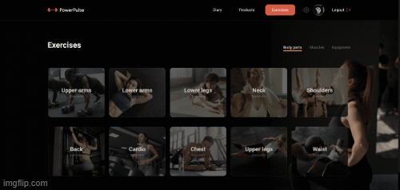

Hello everyone!

We are excited to introduce Power Pulse to you - it's more than just an app,it's
your trusted companion on your journey to health and fitness. Power Pulse is an
innovative and useful tool that will help you achieve your goals.

Welcome: Start with the first page of Power Pulse, where our app greets you.Here
you can create a new account or log in to an existing one. Begin exploring your
current statistical data from day one!

We are excited to introduce Power Pulse to you - it's more than just an app,
it's your trusted companion on your journey to health and fitness. Power Pulse
is an innovative and useful tool that will help you achieve your goals.

Welcome: Start with the first page of Power Pulse, where our app greets you.
Here you can create a new account or log in to an existing one. Begin exploring
your current statistical data from day one!

Sign Up (/signup): Create your account by providing your name, email, and a
secure password.

Sign In (/signin): For our existing users, please enter your email and password.

Data Input / Profile (/profile): After successful registration, you will be
directed to the data input page, where you will need to provide all necessary
information about yourself to achieve your goals. On the profile page, you can
view and update your data in the future.

Diary (/diary): Track your nutrition and workouts on the diary page. The
information panel will help you tracking your progress.

Products (/products): Select items for your diary. Utilize filters to find the
perfect options for you.

Exercises (/exercises): Browse the exercises section. Select exercises by
categories and equipment type.

    With our App, you will be able to improve your health and well-being. Use it for your health!!!

    ## Live page

The live page can be accessed through the following link:
https://deadmakar.github.io/PowerPulseTeamPoject

    # Our development team :

- [OLEKSANDR MAKAROV ](https://github.com/DeadMakar) **Front end Team Lead**,
- [DMYTRO KORNIEIEV](https://github.com/kornieiev) **Back end Team Lead** ,
- [KATERYNA OCHERETIANA](https://github.com/KatiaOcheretiana) **Scrum Master,
  Front End Developer**,

- [IVAN MARUSHEVSKYI](https://github.com/MarushevskyiIvan) **Back end
  Developer** ,
- [YURII TABINSKYI](https://github.com/YuriyTabinskuy) **Back end Developer** ,

- [VADYM VAIKAN](https://github.com/vadivai) **Front End Developer** ,
- [DMYTRO LIPINSKYI](https://github.com/Kreker00) **Front End Developer** ,
- [VIACHESLAV RODENKO](https://github.com/rodenkoslava) **Front End Developer**,
- [DMYTRO ZINCHUK](https://github.com/DimaStout) **Front End Developer**,
- [MAKSYM KOREIKO](https://github.com/makswelll) **Front End Developer**,
- [VLADYSLAV HELICH](https://github.com/Vlad3039) **Front End Developer**.

# Our development team :

# Technologies used:

Frontend:

- HTML/CSS,
- JS,
- Axios,
- React,
- Redux,
- ReduxToolkit,
- Persist,
- Pagination.

Backend:

- Node.js,
- Express,
- Mongoose,
- Mongo DB,
- Render,

- [Swagger Documentation](https://powerpulseback.onrender.com/api-docs/#/)

Utils:

- VSCode,
- Vite,
- Figma,
- Git/GitHub.

# Power Pulse (UKR)

Вітаємо! Раді бачити Вас у нашому додатку Power Pulse.

Ми раді представити вам Power Pulse - це не просто додаток, а ваш вірний
помічник на шляху до здоров'я та фітнесу. Power Pulse - це інноваційний і
корисний інструмент, який допоможе вам в досягненні ваших цілей.

Ласкаво просимо (/welcome): Почніть з першої сторінки Power Pulse, де вас вітає
наш додаток. Тут ви можете створити новий обліковий запис або увійти в існуючий.
Починайте вивчати свої поточні статистичні дані вже з першого дня!

Sign Up (/signup): Зареєструйтеся, використовуючи своє ім'я, електронну пошту та
надійний пароль.

Sign In (/signin): Для тих, хто вже користується нашим сервісом, просто вкажіть
вашу електронну адресу та пароль.

Data Input / Profile (/profile): Після успішної реєстрації ви перейдете на
сторінку введення інформації, де вам потрібно буде заповнити всі необхідні дані
про себе для досягнення ваших цілей. На сторінці профілю ви зможете переглядати
та оновлювати вашу інформацію в майбутньому.

Diary (/diary): Відстежуйте вашу харчову та тренувальну активність на сторінці
Diary. Інформаційна панель допоможе вам оцінити ваш прогрес.

Products (/products): Оберіть продукти для вашого журналу (Diary).
Використовуйте фільтри, щоб знайти ідеальні варіанти для вас.

Exercises (/exercises): Відкрийте розділ з вправами. Вибирайте вправи за
категоріями та типом обладнання.

    З нашим додатком ви зможете покращити своє здоров'я та самопочуття. Користуйтеся на здоров'я!!!

# Power Pulse (DE)

Hallo zusammen!

Wir freuen uns, euch Power Pulse vorstellen zu können - es ist mehr als nur eine
App, es ist euer zuverlässiger Begleiter auf eurem Weg zu Gesundheit und
Fitness. Power Pulse ist ein innovatives und nützliches Werkzeug, das Ihnen
helfen wird, Ihre Ziele zu erreichen.

Willkommen: Beginnen Sie mit der ersten Seite von Power Pulse, auf der Sie
unsere App begrüßt. können Sie ein neues Konto erstellen oder sich bei einem
bestehenden Konto anmelden. Beginnen Sie mit der Erkundung Ihrer aktuellen
statistischen Daten vom ersten Tag an!

Sign Up (/signup): Erstellen Sie Ihr Konto, indem Sie Ihren Namen, Ihre
E-Mail-Adresse und ein sicheres Passwort.

Sign In (/signin): Für unsere bestehenden Benutzer, geben Sie bitte Ihre E-Mail
und Kennwort ein.

Data Input / Profile (/profile): Nach erfolgreicher Registrierung werden Sie zur
Dateneingabeseite weitergeleitet, auf der Sie alle notwendigen Informationen
Informationen über sich selbst angeben müssen, um Ihre Ziele zu erreichen. Auf
der Profilseite können Sie Ihre Daten einsehen und in Zukunft aktualisieren.

Diary (/diary): Verfolgen Sie Ihre Ernährung und Ihre Trainingseinheiten auf der
Tagebuchseite. Die Seite Informationsfeld hilft Ihnen, Ihre Fortschritte zu
verfolgen.

Products (/products): Wählen Sie Produkte für Ihr Tagebuch aus. Verwenden Sie
die Filter, um die perfekten Optionen für Sie zu finden.

Exercises (/exercises): Durchsuchen Sie den Bereich Übungen. Wählen Sie die
Übungen nach Kategorien und Gerätetypen

    Mit unserer App können Sie Ihre Gesundheit und Ihr Wohlbefinden verbessern. Verwenden Sie sie für Ihre Gesundheit!!!
