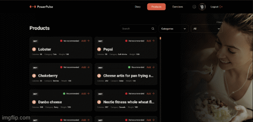

- Hello everyone!

We are excited to introduce Power Pulse to you - it's more than just an app,it's
your trusted companion on your journey to health and fitness. Power Pulse is an
innovative and useful tool that will help you achieve your goals.

Welcome: Start with the first page of Power Pulse, where our app greets you.Here
you can create a new account or log in to an existing one. Begin exploring your
current statistical data from day one!

- Sign Up (/signup): Create your account by providing your name, email, and a
  secure password.

  

- Sign In (/signin): For our existing users, please enter your email and
  password.

  

- Data Input / Profile (/profile): After successful registration, you will be
  directed to the data input page, where you will need to provide all necessary
  information about yourself to achieve your goals. On the profile page, you can
  view and update your data in the future.

  

- Diary (/diary): Track your nutrition and workouts on the diary page. The
  information panel will help you tracking your progress.

- Products (/products): Select items for your diary. Utilize filters to find the
  perfect options for you.

  

  - Exercises (/exercises): Browse the exercises section. Select exercises by
    categories and equipment type.

    

    # Our development team :

- [OLEKSANDR MAKAROV ](https://github.com/DeadMakar) **Front end Team Lead**,
- [DMYTRO KORNIEIEV](https://github.com/kornieiev) **Back end Team Lead** ,
- [KATERYNA OCHERETIANA](https://github.com/KatiaOcheretiana) **Scrum Master,
  Front End Developer**,

- [IVAN MARUSHEVSKYI](https://github.com/MarushevskyiIvan) **Back end
  Developer** ,
- [YURII TABINSKYI](https://github.com/YuriyTabinskuy) **Back end Developer** ,

- [VADYM VAIKAN](https://github.com/vadivai) **Front End Developer** ,
- [DMYTRO LIPINSKYI](https://github.com/Kreker00) **Front End Developer** ,
- [VIACHESLAV RODENKO](https://github.com/rodenkoslava) **Front End Developer**,
- [DMYTRO ZINCHUK](https://github.com/DimaStout) **Front End Developer**,
- [MAKSYM KOREIKO](https://github.com/makswelll) **Front End Developer**,
- [VLADYSLAV HELICH](https://github.com/Vlad3039) **Front End Developer**.

# Technologies used:

Frontend:

- HTML/CSS,
- JS,
- Axios,
- React,
- Redux,
- ReduxToolkit,
- Persist,
- Pagination.

Backend:

- Node.js,
- Express,
- Mongoose,
- Mongo DB,
- Render,
- [Swagger Documentation](https://powerpulserver.onrender.com/api-docs/#/)

Utils:

- VSCode,
- Vite,
- Figma,
- Git/GitHub.
